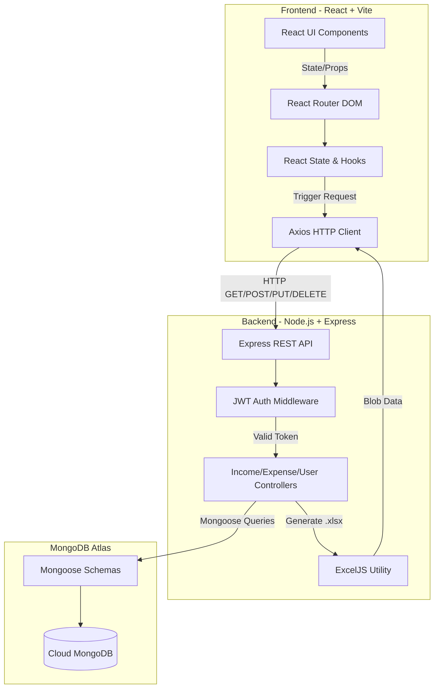

# 📊 Full-Stack MERN Expense Tracker

A modern, responsive, full-stack financial dashboard application built to track personal income, expenses, and savings. Developed over a structured 15-day sprint, this application features secure JWT authentication, interactive data visualization, and Excel data exporting.

---

## What I Built
I built a complete expense management system from scratch using the MERN stack. The application allows users to securely create an account, log in, and manage their daily finances. 

**Key Features:**
* **Secure Authentication:** JWT-based user login and registration with Bcrypt password hashing.
* **Interactive Dashboard:** Real-time calculation of Total Balance, Monthly Income/Expense, and Saving Rates.
* **Data Visualization:** Dynamic pie charts visualizing expense distribution by category using Recharts.
* **Excel Export:** Users can download their income and expense history directly to `.xlsx` files.
* **Accessible & Responsive:** Fully responsive layout with mobile-friendly sidebars and accessible, perfectly centered modal forms using explicit label tags.

---

## Architecture Diagram

The application follows a standard Client-Server architecture utilizing a RESTful API.



---

## How to Run Locally

### Prerequisites
* Node.js (v18 or higher)
* MongoDB Atlas Account (or local MongoDB instance)
* Git

### Installation

**1. Clone the repository:**
```bash
git clone https://github.com/AryanSingh1344/expense-tracker.git
cd expense-tracker
```

**2. Setup the Backend:**
```bash
cd backend
npm install
```
Create a `.env` file in the `backend` directory and add your credentials:
```env
MONGO_URI=mongodb+srv://<username>:<password>@cluster0...
PORT=4000
JWT_SECRET=your_super_secret_key_here
```
Start the backend server:
```bash
npm start
```

**3. Setup the Frontend:**
Open a new terminal window:
```bash
cd frontend
npm install
```
Start the Vite development server:
```bash
npm run dev
```

**4. View the App:**
Open your browser and navigate to `http://localhost:5173`. 
*(Ensure your backend is running simultaneously on port 4000).*
